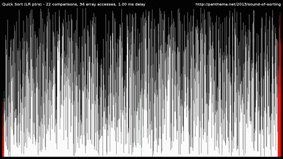

# push_swap

Push_swap is a sorting algorithm project developed in C. The goal is to sort a stack of integers using the minimum number of predefined operations.



## 📝 Description

The push_swap program receives a list of integers as arguments and outputs the sequence of stack operations needed to sort them in ascending order.
A checker program is included, which takes a list and a sequence of operations (via stdin) and reports whether the result is correctly sorted.

The challenge is not just to sort but to do so efficiently — minimizing the number of operations, handling edge cases, and ensuring robust error management.

## 🛠️ Usage

1️⃣ **Clone the repository**

```bash
git clone https://github.com/ngtina99/push_swap.git push_swap
cd push_swap
```

2️⃣ Build

```bash
make
```

3️⃣ Run

./push_swap [list of integers]

*Example*
```bash
./push_swap 2 1 3 6 5 8
```

### Bonus

⭐ Build
```bash
make bonus
```

⭐ Run
./checker [list of integers]

*Example*
```bash
echo -e "sa" | ./checker 2 1 3
```

## 🏆 Performance Scores
```text
| Dataset Size    | Instructions Used   | Evaluation Score  |
| --------------- | ------------------- | ------------------|
| 3 values        | ≤ 3 moves           | Excellent         |
| 5 values        | ≤ 8 moves (kudos)   | Excellent         |
| 100 values      | <700 moves          | Excellent (5/5)   |
| 500 values      | <5500 moves         | Excellent (5/5)   |
```

## ✏️ Stack operations
```text
| Command | Description                      |
| ------- | -------------------------------- |
| `sa`    | swap top two of stack a          |
| `sb`    | swap top two of stack b          |
| `ss`    | swap both a and b simultaneously |
| `pa`    | push top of b onto a             |
| `pb`    | push top of a onto b             |
| `ra`    | rotate a upwards                 |
| `rb`    | rotate b upwards                 |
| `rr`    | rotate both a and b upwards      |
| `rra`   | rotate a downwards               |
| `rrb`   | rotate b downwards               |
| `rrr`   | rotate both a and b downwards    |
```

## 💼 Connect
If you have any questions or suggestions, feel free to connect:
🔗 [LinkedIn: Valentina Nguyen](https://www.linkedin.com/in/valentina-nguyen-t/) 🙋‍♀️

## 📜 License
This project is licensed under the MIT License. See LICENSE for details.

## 🖥️ System Compatibility
This project was developed and tested on Linux (Ubuntu).
